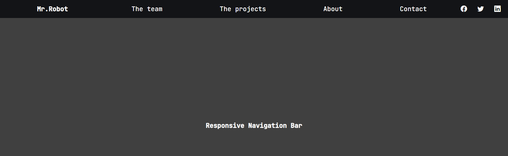
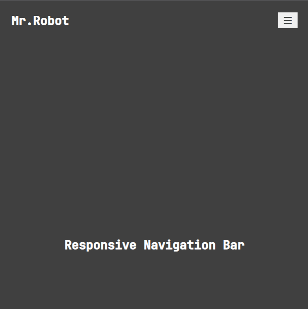
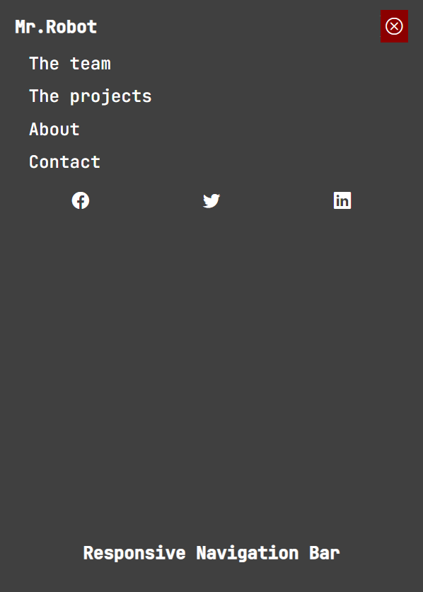

# Proyectos-JS
Una serie de proyectos realizados, tomando como referencia el artículo de FreeCodeCamp

### ReponsiveNavBar

#### Description
- A responsive navigation bar 
- It is using a little of  Bootstrap
 
***

### Carrusel-Revision project

#### Description 
- Visualize the reviews of a random users
- It is using an APIs to get the data
- It is using event listeners

***
### El Contador project

#### Description
- Increase the value of the counter
- Decrease the value of the counter
- Reset the value of the counter
- It is using event handlers

***
### Paleta de color project

#### Description
- Colores por nombres is using an array and random numbers to set the background color
- Colores HEX is using a random number to set a color
- Reset the value of the counter
- It is using event listeners 
